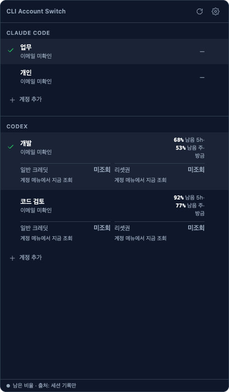
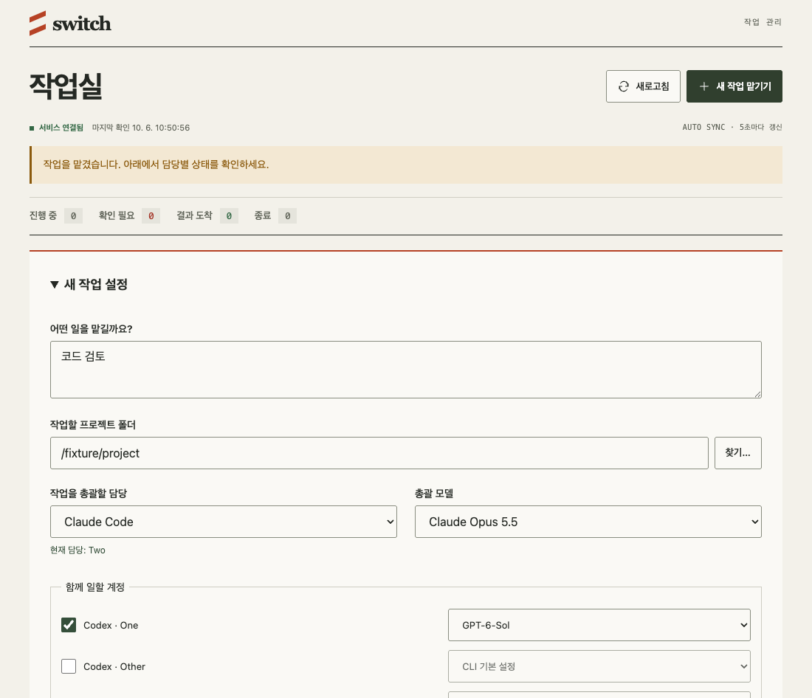
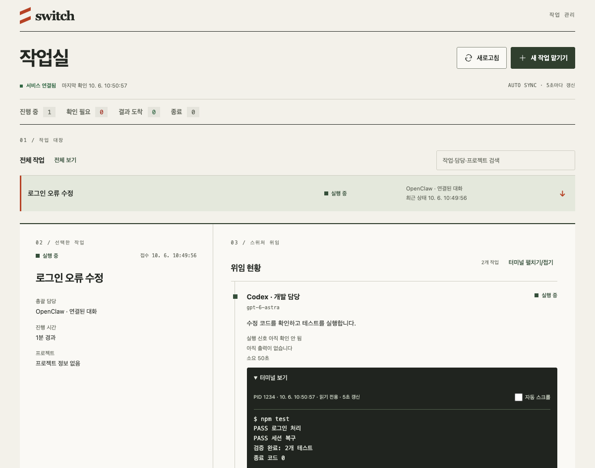
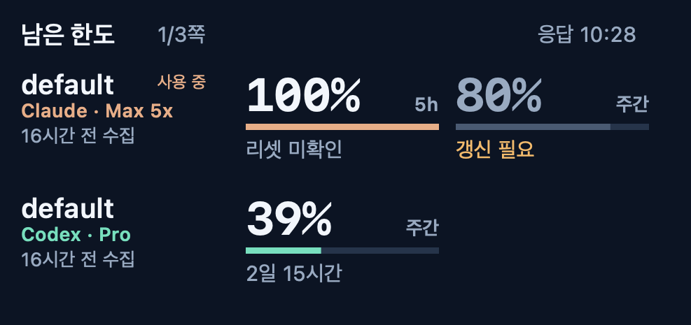
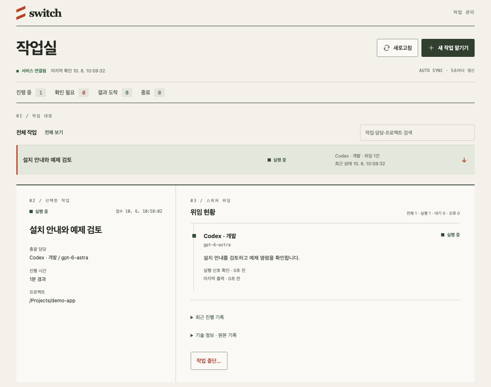

<div align="center">

# CLI Account Switch

**English** | [한국어](README.ko.md)

**Manage your Claude Code and Codex CLI accounts in one place.**

Local profiles · CLI launches · Usage records · Managed tasks


[](LICENSE)

[Getting started](#getting-started) · [Features](#features) · [How it works](#how-it-works) · [Web dashboard](#web-dashboard) · [Development](#development)

</div>

---

CLI Account Switch is an Electron desktop app for managing multiple local Claude Code and Codex CLI profiles. It separates configuration homes and launches each official CLI with the selected profile. The official CLIs handle sign-in and model requests.

> **Preview** — Current version: `0.2.0-preview.8`. Signed and notarized installers are not yet available. Windows build configuration is included, but managed task execution on Windows is not supported. [Release notes](docs/releases/v0.2.0-preview.8.md).

## Screenshots

The three desktop screenshots below use the actual app renderer with synthetic data. Account labels, usage values, model lists, task states, and terminal output are examples—not real accounts or execution results. Screenshots show the current Korean-language UI.

### Account profiles

Select Claude Code and Codex profiles and view locally recorded usage.



### Task setup and model selection

Choose a project folder, coordinator, model, and participating accounts.



### Task status and terminal output

Inspect delegated work and read-only terminal output in one view.



### Scriptable widget design preview

A reference design for displaying per-account usage and record timestamps. **This is a layout preview generated on macOS, not an iPhone screenshot.** Values do not represent current usage. The widget code and its server are not included in this repository.



## Features

| Feature | What it does |
| --- | --- |
| **Account profiles** | Add and select separate profiles for Claude Code and Codex. |
| **Profile-specific launches** | Start new CLI sessions with the selected configuration home. |
| **Shared skills and instructions** | Link skills, instructions, and settings from the default home instead of maintaining duplicate copies. |
| **Shared stored memory** | Link the existing Codex `memories` directory into new profiles. Conversation sessions are not transferred. |
| **Local usage records** | Read Claude status-line records and Codex session records. |
| **Task management** | Track execution, reviews, and result delivery. |
| **Task context and session resume** | Persist goals, results, reviews, and session IDs; resume the same coordinator session on subsequent turns. |
| **Web dashboard** | Submit, inspect, respond to, and cancel tasks from a local browser; view terminal output. |
| **Model selection** | Select account-scoped models for coordination and delegated work. |
| **Read-only terminal output** | Inspect task output with periodic refresh. |
| **Project selection** | Use a native folder picker in the app or server-side folder browsing in the dashboard. |
| **Optional OpenClaw integration** | Connect managed work to the current conversation through a plugin. |

## Getting started

### Requirements

- **Node.js 24+**, npm, and Git
- The official CLIs you intend to use: Claude Code (`claude`) and Codex (`codex`)
- Your own accounts with access to the corresponding services
- A desktop environment capable of running Electron

Install the official CLIs separately. This app does not provide service accounts or subscription access.

### Run from source

```sh
git clone https://github.com/HoonStyle/cli-account-switcher.git
cd cli-account-switcher
npm ci
npm start
```

Prebuilt preview installers are available from [GitHub Releases](https://github.com/HoonStyle/cli-account-switcher/releases).

### First launch

1. Open the app from the menu bar or system tray. It starts hidden by default.
2. Add a profile for the CLI you want to use.
3. Complete the official CLI's sign-in flow for that profile.
4. Select the profile and launch a new CLI session or task.
5. Configure local usage collection if you want usage indicators.

> Switching profiles affects **new launches only**. It does not change existing terminal sessions or authentication stored independently by other apps.

## How it works

```text
CLI Account Switch
  ├─ Claude profile → CLAUDE_CONFIG_DIR → Official Claude Code CLI
  └─ Codex profile  → CODEX_HOME        → Official Codex CLI
                                            └─ Direct provider communication
```

| CLI | Profile configuration home | Environment variable |
| --- | --- | --- |
| Claude Code | `~/.cli-accounts-distribution/claude/<profile>/` | `CLAUDE_CONFIG_DIR` |
| Codex | `~/.cli-accounts-distribution/codex/<profile>/` | `CODEX_HOME` |

New profiles use their own local directories and the official sign-in flow. They do not sign in by copying another account's credentials.

### Default profile and app data

The `default` profile uses the official CLI's existing home, `~/.claude` or `~/.codex`, without a separate configuration-home override. It therefore shares the default login and status-line settings used when running that CLI directly.

App data lives in `~/.cli-accounts-distribution` by default. You can override this with `CLI_ACCOUNTS_ROOT`, but do not reuse another tool's data directory. Avoid duplicate usage hooks and make sure PATH selects the intended CLI wrappers.

## Shared skills, instructions, and memory

Profiles can keep separate logins while sharing skills and instructions. When creating a profile, the app links these existing items from the official CLI's default home:

| CLI | Source | Shared items |
| --- | --- | --- |
| Claude Code | `~/.claude/` | `settings.json`, `CLAUDE.md`, `plugins`, `skills`, `agents`, `commands`, `hooks`, `rules` |
| Codex | `~/.codex/` | `config.toml`, `AGENTS.md`, `skills`, `plugins`, `rules`, `memories` |

For example, profiles linked to `~/.codex/skills` reference the same directory. Editing linked content affects every profile referencing that source. This uses **the CLI's default home as the shared source**, rather than moving skills into a separate registry.

### Stored context is not a conversation session

Instructions such as `CLAUDE.md` and `AGENTS.md`, along with Codex's `memories` directory, are eligible for sharing. The app does not summarize conversations to create memories; creation and use of `memories` depend on the CLI.

Conversation history and running sessions are not part of this shared-file list. **Switching accounts alone does not restore an entire conversation or transfer a running task's context.**

### Sharing behavior

- Sharing is enabled by default when adding a profile in the app.
- Only source items present at creation time are linked. Existing destination items are not overwritten.
- The app uses symbolic links, with directory junctions on Windows. If a file link fails, it falls back to a one-time copy; copied files do not stay synchronized.
- Adding a source item later does not automatically create links in existing profiles.
- Use the app-installed CLI with `--no-share` to create a profile without shared settings:

```sh
cli-accounts add codex isolated --no-share
```

## Task context and session resume

Managed tasks persist their goal, project path, baseline commit, participating accounts, execution attempts, delegated results, reviews, and coordinator session ID in SQLite. The default database is `~/.cli-accounts-distribution/runtime/tasks.sqlite`. Per-attempt records in the runtime directory also retain prompts and results.

Subsequent coordinator turns use Claude's `--resume` or Codex's `exec resume` to continue the same session. Follow-up prompts include delegated results, review states, and additional user input. OpenClaw integration uses the bound conversation's identifiers.

This preserves **managed task context**. It does not collect every terminal conversation or automatically move sessions between accounts. After a service restart, the runtime reconciles persisted execution state and results. Ambiguous execution remains flagged for inspection rather than being blindly relaunched. The original CLI session and profile data must also remain available.

Task records can contain prompts, project paths, and output. Do not commit the runtime directory to a public repository.

### Execution and recovery

`executionPolicy` defaults to `edit-only`. Explicit `build-test` permission for a writable Claude task enables restricted build/test commands on macOS; it requires Claude Code 2.1.290+ with the supported sandbox flags and the relevant SDK. Installing an update does not upgrade existing task permissions.

Tasks paused before execution can be resumed with bounded retry/round limits. Follow-up delegations can explicitly receive versioned files from earlier task worktrees; those changes are not automatically merged into the original project.

## Web dashboard

Use the same task-management interface in a local browser. From the source directory:

```sh
node src/cli.js dashboard
# Open http://127.0.0.1:18473 in your browser
```

If the app-installed `cli-accounts` command is on PATH:

```sh
cli-accounts dashboard
cli-accounts dashboard --port 18474
```

- Choose a project folder, accounts, and models, then submit work.
- Inspect task status, delegated results, reviews, and read-only terminal output.
- Respond to requests for input or cancel work through a confirmation step.
- Folder selection browses **the filesystem of the computer running the server**.

The screenshot below was captured from the actual HTTP dashboard using synthetic data, not real accounts or task execution results.



### Access and security

The server binds to `127.0.0.1` by default and validates the host, Origin, and request headers. It does not provide a separate user sign-in system. Because it can launch tasks and expose paths and output, do not expose it directly to the internet.

`--public-origin https://host` only adds an allowed origin for a reverse proxy. It does not configure authentication or an HTTPS server. Remote access requires a separately configured proxy with authentication, access controls, and TLS.

## Usage and authentication

- **Claude Code:** usage comes from local status-line records.
- **Codex:** usage comes from local session records.
- The official CLIs manage credentials for sign-in and provider communication.
- The app does not read account credentials to collect email metadata or call usage endpoints directly. Use profile labels to identify accounts.

Usage appears after the CLI writes a supported local record. Missing or older records can leave values unavailable or out of date. **Real-time balances and quotas are not guaranteed.**

## OpenClaw integration

```sh
npm run build:plugin
openclaw plugins install ./plugins/openclaw
```

- The plugin manifest requires OpenClaw **2026.9.6** or later. Verify API compatibility with your installed version.
- The plugin uses the app's data directory. Do not install duplicate plugins with the same plugin or tool IDs.
- Result delivery requires explicit acknowledgment. An ambiguous send/ack boundary does not guarantee exactly-once delivery.
- `account_tasks get` returns a compact summary. Read `context`, `task`, or `final` pages using the returned `nextOffset` and `queryRevision`; summaries are not complete review evidence.
- The dashboard can separately show recent OpenClaw activity through read-only Gateway queries. Offline records are marked stale, and an observed execution ending does not imply the user's goal is complete.

### Unreleased runtime contract changes

- Execution, review, user-input requests, and delivery are separate states. A versioned `inputRequest` preserves the blocker independently of runner warnings. After reporting it to the bound conversation and verifying delivery, use `ack_attention` with that exact `attentionVersion`; only an explicit response or bounded `resume` continues the work.
- Tool task `state` uses the same execution observation as the dashboard; `ledgerState` retains the persisted scheduling state. Detail history contains the latest 500 events in chronological order.
- Paging happens in the service, before RPC transmission. The dashboard uses bounded previews and restores complete task evidence on expansion, pinned to the same result revision. OpenClaw and the local UI share one projector; truncated previews are not treated as complete evidence. Current execution is selected by its persisted attempt ID, not the wall clock.
- Mutations require a same-connection protocol handshake. Mixed client/service versions are rejected before applying changes, without restarting active work. RPC requests are limited to 1 MiB including the full UTF-8 JSON envelope and newline; oversized requests are rejected before mutation. Shorten and retry the same task/attempt/generation, not a new task.
- Normal split UTF-8 output is preserved. Invalid stdout or authoritative result-file encoding fails the execution instead of silently storing repaired text as a successful result. The raw diagnostic `get`/`list` RPCs retain an 8 MiB response limit; normal dashboard and OpenClaw reads use the bounded read APIs.

## Development

### Tests

```sh
npm ci
npm test                 # Basic behavior
npm run test:runtime     # Runtime checks — macOS
npm run test:dashboard   # Dashboard and Electron UI checks — macOS
npm run test:reset-ui    # Renderer regression checks — macOS
npm run build:plugin     # Build the OpenClaw plugin
```

Electron UI tests require a desktop environment.

### Build installers

```sh
npm run dist:mac   # Universal macOS DMG
npm run dist:win   # Windows NSIS installer and portable build
```

Artifacts are written to `dist/`. Build on the corresponding operating system. macOS signing and notarization are not currently configured.

### GitHub Actions

The [verification and build workflow](.github/workflows/ci.yml) runs basic tests and plugin builds on macOS and Windows for pushes to `main` and pull requests. macOS also runs runtime, dashboard, and renderer tests.

Manual dispatch (`workflow_dispatch`) builds installers and retains artifacts for seven days. The separate [publish workflow](.github/workflows/publish-release.yml) takes the successful build run ID and exact commit SHA, verifies provenance, and publishes a prerelease with installer checksums. Signing, notarization, and Windows runtime validation remain separate tasks.

## Limitations

- The currently enabled CLIs are Claude Code and Codex.
- Windows installer build configuration is included, but managed task execution on Windows is not supported.
- Usage depends on local records and may differ from current provider quotas.
- Profile switching does not change existing CLI sessions or other apps' independent authentication.
- Provider terms and access requirements still apply. The app does not create accounts, share subscriptions, proxy authentication, rotate accounts on rate limits, or bypass access restrictions.

## License

[MIT License](LICENSE) · Copyright (c) 2026 HoonStyle

External CLIs and services remain subject to their own licenses and terms.
